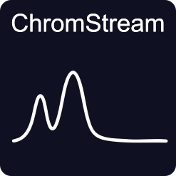

# ChromStream

<p align="center">
  
</p>

A Python package for processing on-line gas chromatography data. ChromStream provides tools to parse, analyze, and visualize chromatographic data from various GC systems, and combine it with data from logfiles such as temperature and pressure.

## Features

- Parse chromatographic data from multiple formats:
    - Chromeleon (exported txt)
    - Agilent .d directories
    - Agilent .dx files
    - ChromStream HDF5 experiment files
- Access to data at experiment, channel and chromatogram level
- Quick plotting of chromatograms
- Small selection of baseline corrections, possibility to use custom ones
- Integration using a dict of peaks
- Addition of logfiles
- Export experiments to a compact HDF5 format

## Installation

### Installing using pip

```bash
pip install ChromStream
```

### Install using uv

If you're using [uv](https://github.com/astral-sh/uv) for fast Python package management:

```bash
uv add ChromStream
```
## Quick Start

Check the Quickstart Notebook to see a full demonstration of the most important features of the package. 
Here's a simple example of how to set up an experiment, add chromatograms and plot them:

```python
import chromstream as cs

exp = cs.Experiment(name='hello there')
exp.add_chromatogram('path-to-your-chromatogram') #loop over files to add multiple
exp.plot_chromatograms()
```

To access specific channels:
```python
exp.channels['channel-name'].plot()
```

For specific chromatograms:

```python
exp.channels['channel-name'].chromatograms[0].plot()
```

## Supported File Formats

ChromStream currently supports parsing data from:

- Chromeleon software exports (`.txt`)
- Agilent .d directories and .dx files
- ChromStream HDF5 experiment files (`.h5`)
- simple log files (e.g. exported from labview)

ChromStream can also export `Experiment` objects to HDF5 and load them back again:

```python
import chromstream as cs

exp = cs.Experiment(name="example")
exp.add_mult_chromatograms("path-to-run.dx")
exp.to_hdf5("example.h5")

loaded = cs.parse_experiment_hdf5("example.h5")
```

## Documentation

- You can find the full documentation of the package [here](https://myonics.github.io/ChromStream/).

## Example Notebooks

Check out the `example_notebooks/` directory for comprehensive examples:

- `example_calibration.ipynb` - GC calibration procedures
- `cracking_example.ipynb` - full procedure for analyzing a cracking dataset
- `exporting_hdf5.ipynb` - brief example showing HDF5 export and re-loading


## Roadmap
- Support for more files formats
- Addition of more data sources such as spectroscopy
- JSON persistence
- tests

## Contributing
This package is in active development. Any help is appreciated. You can submit feature requests or bug reports as issues on the repository.
If you have a specific file format which presently is nto supported please provide an example file.
PRs are more than welcome.

## Authors

Sebastian Rejman - Fritz-Haber-Institute / Utrecht University

